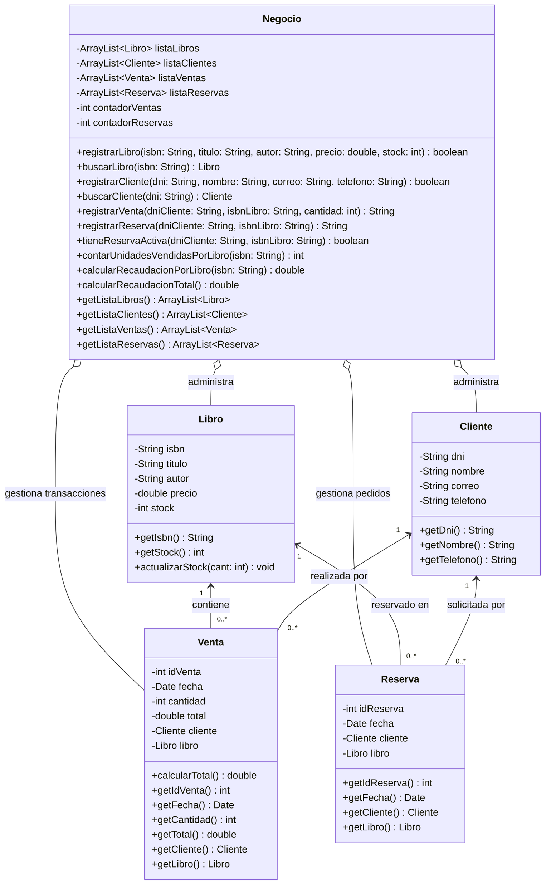

# Sistema de Gestión de Librería Académica "Page Turner"
> **Evaluación T1 — Programación Orientada a Objetos (POO)**  
> **Universidad Privada del Norte (UPN)** — Semestre 2026-2

---

## 📌 Información Académica y Equipo de Desarrollo

* **Institución:** Universidad Privada del Norte (UPN)
* **Curso:** Programación Orientada a Objetos
* **Docente:** Victor Alfredo Muguerza Capristan
* **Grupo:** Grupo 7

### Integrantes
| N° | Apellidos y Nombres | Código de Estudiante |
|:--:|:--------------------|:--------------------:|
| 1 | Salas Chuco, David Samuel | `n00452118` |
| 2 | Tacuri Rosales, Cristhian Arturo | `n00569399` |
| 3 | Tomas Espinoza, Diogo Enilson | `n00476546` |
| 4 | Vasquez Medina, Libia Elena | `n00156923` |

---

## 📖 Descripción del Caso de Negocio

La librería académica **"Page Turner"**, dirigida por la señora Carmen Vidal y ubicada dentro del campus universitario en Lima, atiende a estudiantes, docentes e investigadores que buscan adquirir o reservar material bibliográfico para sus cursos. 

Históricamente, la gestión se llevaba a cabo de forma manual mediante cuadernos de apuntes y hojas de cálculo no integradas, lo que generaba:
* Inconsistencias entre el stock físico y las transacciones de venta.
* Extravío recurrente de los datos de contacto de estudiantes en lista de espera.
* Falta de consolidación financiera e incapacidad de identificar los libros con mayor demanda.

### Enfoque Arquitectónico de la Solución
Para garantizar un diseño desacoplado y reutilizable (alineado al principio de separación de responsabilidades y la arquitectura MVC), este repositorio contiene exclusivamente la **capa de lógica y modelo de negocio pura** en Java. Se han extraído por completo las dependencias de interfaces de terminal o vistas, dejando un núcleo de dominio independiente que encapsula las entidades y reglas del negocio.

---

## 🏛️ Principios POO y Diseño de Software

1. **Separación de Responsabilidades y Alta Cohesión:**
   * Las entidades (`Libro`, `Cliente`, `Venta`, `Reserva`) representan exclusivamente los datos y comportamientos intrínsecos a su naturaleza.
   * La clase controladora `Negocio` asume la responsabilidad de coordinar las transacciones, administrar las colecciones dinámicas (`ArrayList`) y salvaguardar las reglas del negocio.
2. **Encapsulamiento Estricto:**
   * Todos los atributos de todas las clases son estrictamente privados (`private`).
   * El estado interno solo se altera mediante métodos controlados (`actualizarStock`, `registrarVenta`, `registrarReserva`).
3. **Desacoplamiento de la Interfaz:**
   * Los métodos de negocio no interactúan con dependencias de entrada/salida de consola. Reciben parámetros primitivos o referencias de entidad, y comunican el resultado mediante retornos tipados (`String` de confirmación/error, booleanos y valores numéricos).
4. **Relaciones Estructurales:**
   * **Composición / Agregación:** `Negocio` alberga y gestiona el ciclo de vida de las listas de libros, clientes, ventas y reservas.
   * **Asociación:** `Venta` y `Reserva` vinculan instancias concretas de `Cliente` y `Libro`.

---

## 📊 Diagrama de Clases UML

---

## 🧩 Especificación de Clases y Responsabilidades

| Clase | Tipo | Responsabilidad Técnica |
|:------|:-----|:------------------------|
| **`Negocio`** | Controlador / Servicio | Núcleo del sistema. Encapsula las colecciones de datos, coordina búsquedas y valida las reglas transaccionales de venta, reserva y reportes. |
| **`Libro`** | Entidad de Dominio | Representa el producto bibliográfico. Mantiene su ficha técnica y actualiza sus existencias mediante `actualizarStock(int cant)`. |
| **`Cliente`** | Entidad de Dominio | Modela la información personal y canales de comunicación del usuario (DNI, nombre, correo, teléfono). |
| **`Venta`** | Entidad Transaccional | Representa la compra concretada. Vincula cliente, libro, fecha de emisión y liquida el total a pagar (`precio * cantidad`). |
| **`Reserva`** | Entidad Transaccional | Modela el registro en lista de espera ante quiebre de stock, registrando fecha, libro y cliente solicitante. |

---

## 📋 Trazabilidad de Reglas de Negocio Implementadas

* **Integridad de Clientes (RF-02):** Tanto `registrarVenta` como `registrarReserva` exigen que el cliente esté registrado previamente por su DNI. Si el cliente no existe, se bloquea la transacción informando el error correspondiente.
* **Venta y Descuento de Stock (HU-01, RF-03):** 
  * Valida que la cantidad requerida sea mayor a cero y no supere el stock actual.
  * Si el libro no cuenta con stock disponible, se rechaza la venta y se sugiere formalizar una reserva.
  * Al completarse, genera la venta y aplica inmediatamente `libro.actualizarStock(-cantidad)`.
* **Reserva de Títulos Agotados (HU-02, RF-04):**
  * Bloquea la reserva si el ejemplar cuenta con stock (`stock > 0`), exigiendo que se tramite como venta directa.
  * Control de duplicidad: rechaza la solicitud si el cliente ya cuenta con una reserva activa para el mismo ISBN.
* **Consolidación Financiera y Métricas (HU-03, RF-05):**
  * `contarUnidadesVendidasPorLibro(isbn)`: Suma acumulada de unidades comercializadas por libro.
  * `calcularRecaudacionPorLibro(isbn)`: Ingreso monetario bruto generado por cada título.
  * `calcularRecaudacionTotal()`: Rendimiento financiero global de la librería.
