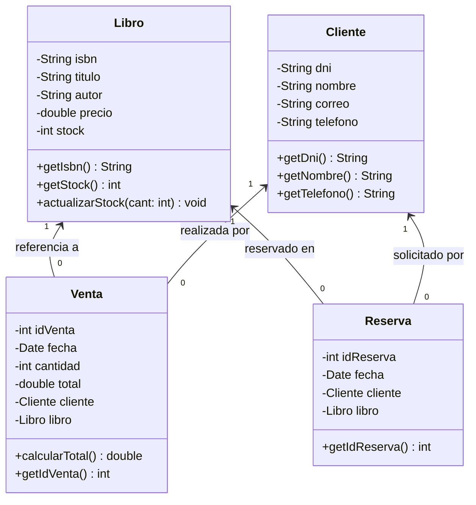

# Sistema de Gestión de Librería Académica "Page Turner"
> **Evaluación T1 — Programación Orientada a Objetos (POO)**  
> **Universidad Privada del Norte (UPN)** — Semestre 2026-2

---

## 📌 Información Académica y Equipo de Desarrollo

* **Institución:** Universidad Privada del Norte (UPN)
* **Curso:** Programación Orientada a Objetos
* **Docente:** Victor Alfredo Muguerza Capristan
* **Grupo:** Grupo 7

### Integrantes
| N° | Apellidos y Nombres | Código de Estudiante |
|:--:|:--------------------|:--------------------:|
| 1 | Salas Chuco, David Samuel | `n00452118` |
| 2 | Tacuri Rosales, Cristhian Arturo | `n00569399` |
| 3 | Tomas Espinoza, Diogo Enilson | `n00476546` |
| 4 | Vasquez Medina, Libia Elena | `n00156923` |

---

## 📖 Descripción del Caso de Negocio

La librería académica **"Page Turner"**, dirigida por la señora Carmen Vidal y ubicada dentro del campus universitario en Lima, atiende a estudiantes, docentes e investigadores que buscan adquirir o reservar material bibliográfico para sus cursos. 

Históricamente, la gestión se llevaba a cabo de forma manual mediante cuadernos de apuntes y hojas de Excel desconectadas, lo que generaba:
* Inconsistencias entre el stock físico y las ventas registradas.
* Extravío recurrente de los datos de contacto de estudiantes en lista de espera.
* Imposibilidad de medir el rendimiento financiero semanal o identificar los libros de mayor demanda.

### Solución Propuesta
Se propone la implementacion de un sistema desarrollado en **Java** que automatiza la operación de la librería en consola bajo el paradigma de la **Programación Orientada a Objetos (POO)**. Facilita la administración del catálogo de libros, el registro de clientes, el procesamiento de ventas con descuento en tiempo real, el control estricto de reservas para títulos agotados y la emisión de reportes financieros consolidados.

---
## Clases del modelo propuesto

- `Libro`: representa los datos bibliográficos, el precio y el stock.
- `Cliente`: representa los datos de contacto del cliente o estudiante.
- `Venta`: relaciona un cliente con un libro y registra la cantidad, la fecha y el total.
- `Reserva`: relaciona un cliente con un libro reservado y registra la fecha.

Las clases aplican encapsulamiento mediante atributos privados, constructores y métodos de acceso. `Venta` y `Reserva` mantienen asociaciones con `Cliente` y `Libro`.

## Diagrama de clases UML

